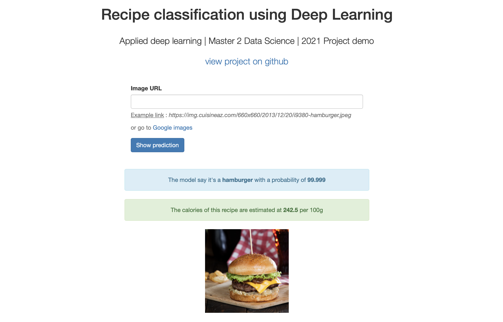

# Applied Deep Learning project - M2 Data Science

## Food images classification

Dataset link : [https://www.kaggle.com/kmader/food41](https://www.kaggle.com/kmader/food41)

Before running the download_data.py file :
1. Connect to your Kaggle account
2. Go to your account settings
3. Create a new API Token 
4. Move the kaggle.json created file to the "credentials" folder

---
### Notebooks

We have decided to develop and train several models for this project in order to do a benchmark. Firstly, we trained a custom model to have a basis for comparison. Then we used pretrained models, Resnet50, InceptionV3 and EfficientNetB0.

There are __two types__ of notebook in the repo:

- **Training notebooks :** These notebooks contain the training codes of the different models we used. They were trained on Kaggle using a GPU. They are long to run, sometimes several hours were necessary. The models trained from these notebooks have been saved in the folder "saved_models/" and can be easily reused. 

- **Analysis notebooks :** These notebooks are further analyses of the results obtained with the previously trained models. They are much shorter to run and can be used to experiment with the results obtained with the different models. 

---
### Accuracy per model

|                 | Train (80800 images) | Test (20200 images) | Kaggle link                                                    |
|-----------------|----------------------|---------------------|----------------------------------------------------------------|
| Custom model v2 | 0.3632               | 0.3206              | https://www.kaggle.com/code/hrialan/custom-model/notebook      |
| Resnet 50       | 0.5344               | 0.5495              | https://www.kaggle.com/code/hrialan/resnet50-training/notebook |
| Inception V3    | 0.8449               | 0.7548              | https://www.kaggle.com/code/hrialan/transfer-learning/notebook |
| Efficient Net   | 0.90                 | 0.85                |                                                                |


---
### Demo web app 



We have developed a demo web application to test the generalization of the model on new images.  For the moment, the application works with our pre-trained model "inceptionV3". The application is linked to a nutrition API and gives the average calorie count of the recognized recipe. 

The application is available at this URL: [https://m2ds-applied-dl-5ezehizkua-uc.a.run.app](https://m2ds-applied-dl-5ezehizkua-uc.a.run.app)

However, the server on which it is hosted is not powerful and may return an error if too many people use the application at the same time. So it is also possible to run the application locally on your own computer  with these command lines : 

```sh
cd web-app 
pip3 install -r requirements.txt 
python3 app.py
```

Finally, if everything worked, the application is available at this link : [http://localhost:5000/](http://localhost:5000/) 
